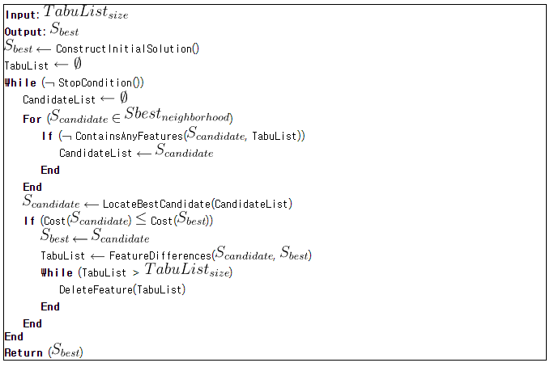

# Tabu Search
- 다른 휴리스틱 과정에서 사용할 수 있는 메타 휴리스틱
- 복잡합 해 영역에서 좋은 해를 얻기 위해 탐색을 유도하는 과정
- 알고리즘 개선

현재 값에서 최소점에 도달 할 수 있는 다른 값을 식별하도록 한다. 그리고 이동하면서 일부를 tabu(금지)로 분류한다.

# procedure

- tabu list를 이용해서 최적의 경로를 찾기위해 경로를 최적화 해가는 방식
- best는 솔루션에 대한 최적의 값
- candidate는 랜덤하게 예측한 최적의 값
- cost는 경로를 이동하는 총 비용
- tabulist를 이용해서 tabu(금지)로 분류

# 참조
- [https://github.com/rbhan/kaggle_tsp](https://github.com/rbhan/kaggle_tsp)
- [http://www.cleveralgorithms.com/nature-inspired/stochastic/tabu_search.html](http://www.cleveralgorithms.com/nature-inspired/stochastic/tabu_search.html)
- [https://www.techconductor.com/algorithms/python/Search/Tabu_Search.php](https://www.techconductor.com/algorithms/python/Search/Tabu_Search.php) 